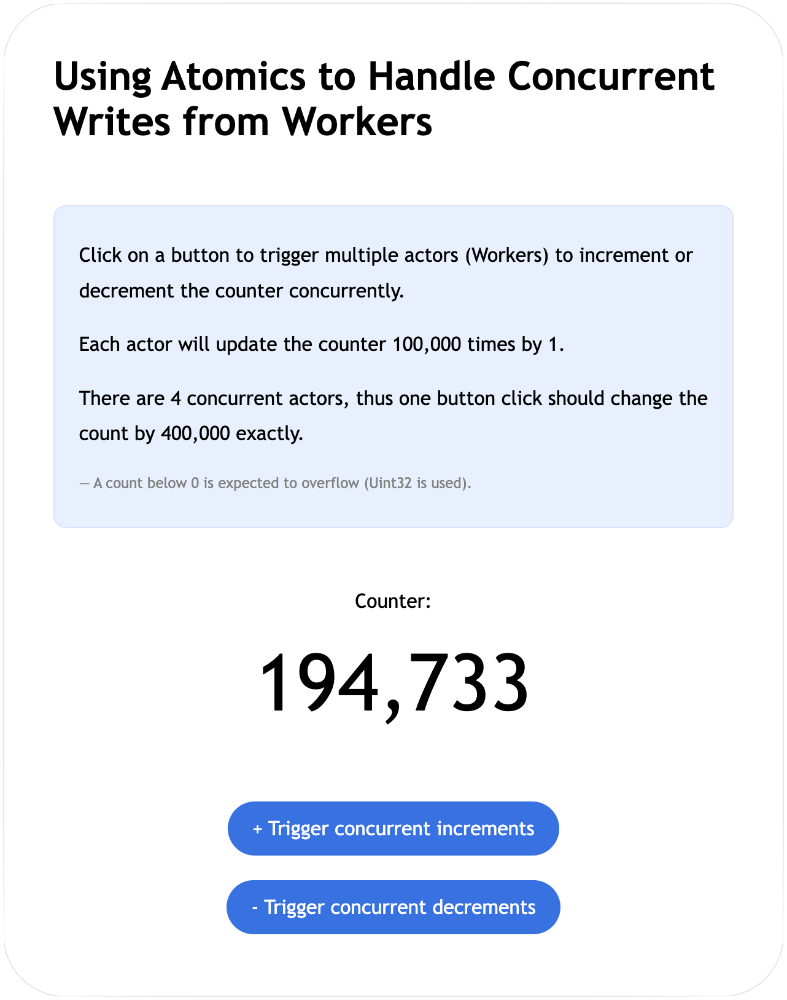
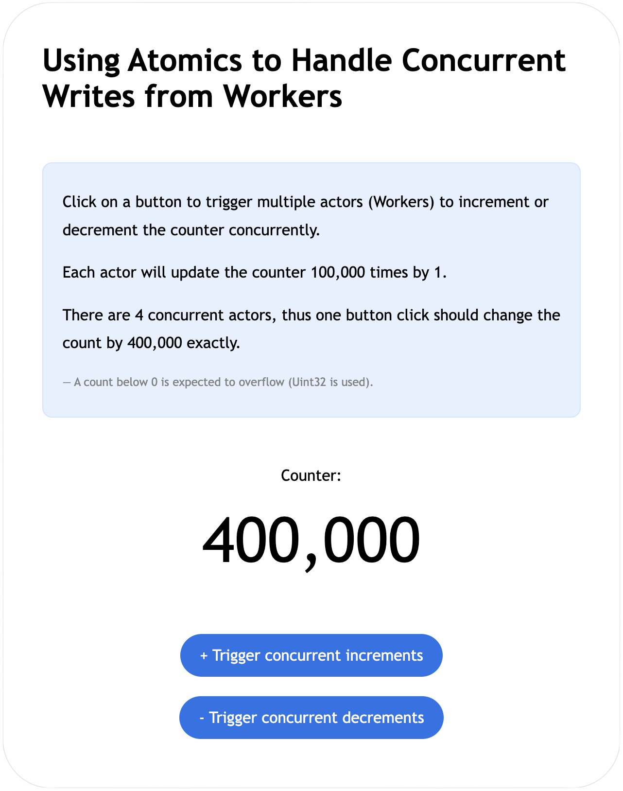

# Atomics

`Atomics` and `SharedArrayBuffer` were introduced in ES2017 following the [proposal for "Shared Memory and Atomics"](https://github.com/tc39/proposal-ecmascript-sharedmem/tree/main).

This project explains and demonstrates those features and the related concepts by implementing examples of a counter that handles concurrent writes.

### Complimentary blog post

For a more detailed explanation and walkthrough, see my complimentary blog post: [JS Series: Using Atomics to Handle Concurrent Writes from Workers](https://www.ellej.dev/blog/js-series-using-atomics-to-handle-concurrent-writes-from-workers/).


# Contents

- [What is it and why do we need it?](#what-is-it-and-why-do-we-need-it-🤔)
  - [Web Workers and parallelism](#web-workers-and-parallelism)
  - [Shared memory and concurrency](#shared-memory-and-concurrency)
  - [Atomic operations](#atomic-operations)
- [Implementing a counter with and without `Atomics`](#implementing-a-counter-with-and-without-atomics)
  - [Counter example 1 (without atomics)](#counter-example-1-without-atomics)
  - [Counter example 2 (with atomics)](#counter-example-2-with-atomics)
  - [Counter example 3 (with mutex)](#counter-example-3-with-mutex)
- [Getting started](#getting-started)


# What is it and why do we need it? 🤔

The ECMAScript proposal was motivated by wanting to enable more powerful parallelism to JavaScript. With parallelism and allowing threads to access the same memory, various complicated concurrency problems also get introduced. Therefore, a global `Atomics` object with static methods for dealing with parallelism and concurrency was also included in the proposal.

> [!NOTE]
> This section contains excerpts from my previously mentioned [blog post](https://www.ellej.dev/blog/js-series-using-atomics-to-handle-concurrent-writes-from-workers/).


## Web Workers and parallelism

Performing computationally intensive operations on the main thread (e.g. the UI thread) could potentially slow down a web application significantly by blocking execution of other code such as updates to the DOM. In this case, offloading such tasks to one or more background threads allows the main execution to continue in parallel and uninterrupted.

Instantiating a `new Worker("some-script.js")` is how we can create a new background thread to have the [web worker](https://developer.mozilla.org/en-US/docs/Web/API/Worker) object execute `some-script.js`. By design, workers are isolated and thus use a messaging system to communicate with their creator (the main thread in this case) and vice versa. Essentially, all actors (main and workers) can send messages to a specific actor (by calling `postMessage()`) and listen for messages sent to them (by setting `onmessage` or calling `addEventListener("message", ..)`).

The below example shows a worker script that will log the message sent from the main thread and then send a message back to it.

```javascript
// say-hi-worker.js

function handleMessageFromMain({ data }) {
  console.log(data);
  postMessage(`Hi from ${self.name}!`);
}
onmessage = handleMessageFromMain;
```

`postMessage` and `onmessage` are available on the global scope, which for dedicated worker contexts is the `DedicatedWorkerGlobalScope` (also accessible via `self`). Thus, there is no access to `window` here. The event received contains a `data` property with the message emitted, which can be *almost* any JS object or value.

On the main thread, let's initialize four workers, attach a listener to each one that will log messages sent from the worker once received, then emit a message to each worker.

```javascript
// main.js

const NUM_WORKERS = 4;
const workers = initWorkers(NUM_WORKERS);

sendMessageToWorkers();
console.log("Messages sent to workers.");

function handleMessageFromWorker({ data }) {
  console.log(data);
}

function initWorkers(size) {
  const workers = [];
  for (let i = 0; i < size; i++) {
    const worker = new Worker("say-hi-worker.js", { name: `Worker #${i}` });
    worker.onmessage = handleMessageFromWorker;
    workers.push(worker);
  }

  return workers;
}

function sendMessageToWorkers() {
  for (const worker of workers) {
    worker.postMessage("Hi from the main thread!");
  }
}
```

What do you think will be logged to the console? Well, since the workers execute in parallel, one may finish earlier than the other, so the time at which the worker posts the message depends on the amount of work it is doing prior to that. In this example however, each worker only logs the data, creating the following output most of the times:

```
Output:

Messages sent to workers.
Hi from the main thread!
Hi from Worker #0
Hi from the main thread!
Hi from Worker #1
Hi from the main thread!
Hi from Worker #2
Hi from the main thread!
Hi from Worker #3
```

Do note that `console.log("Messages sent to workers.")` in `main.js` was not blocked by the call to `sendMessagesToWorkers()`.


## Shared memory and concurrency

If threads need to access the same resource, rather than a copy of it, threads can send a `SharedArrayBuffer`. This allows all agents involved to reference the chunk of memory it represents, which can potentially happen at the same time.

When working with shared memory, several interesting and unpredictable scenarios can happen if there is no synchronization or coordination between the operations. Suppose we have a shared counter starting at value `0` and increment it by `1`.

```javascript
sharedCounter += 1;
```

At a high level, the above operation may look like it is performed as one indivisible (atomic) step.  But an operation like incrementing a value in memory oftentimes involves more steps, such as loading the value from memory, adding 1 to the loaded value, then storing it back into memory:

```javascript
value = memory[sharedCounterAddr]
value = value + 1
memory[sharedCounterAddr] = value
```

Thus, it is possible for another thread to read or write to the same address in the middle of executing the first increment:

```javascript
        // Thread 1                           // Thread 2

Step 1: value = memory[sharedCounterAddr]
Step 2: value = value + 1                     value = memory[sharedCounterAddr]
Step 3: memory[sharedCounterAddr] = value     value = value + 1
Step 4:                                       memory[sharedCounterAddr] = value
```

To appear sequentially consistent, two threads that each increment the counter by `1` should result in `2` being stored in memory. The concurrency problem in the example above results in Thread 2 overwriting the stored value with `1`. This is exactly what `Atomics` can help us address.


## Atomic operations

When an operation is said to be atomic, it means that it cannot be further split into smaller operations. Thus, two or more concurrent atomic operations should produce a sequentially consistent result.

The global [Atomics](https://tc39.es/ecma262/multipage/structured-data.html#sec-atomics-object) object exposes static methods for performing operations on shared memory atomically, such as `Atomics.add()` and `Atomics.load()`. In the previous example where two threads increment a counter concurrently, we can replace the high-level code `sharedCounter += 1` with:

```javascript
Atomics.add(sharedCounterBufferView, index, 1);
```

That would make the operations execute one after the other.

```javascript
        // Thread 1                           // Thread 2

Step 1: value = memory[sharedCounterAddr]
        value = value + 1
        memory[sharedCounterAddr] = value
Step 2:                                       value = memory[sharedCounterAddr]
                                              value = value + 1
                                              memory[sharedCounterAddr] = value
```

We can try this out in the browser by implementing a counter.


# Implementing a counter with and without `Atomics`

The project contains three different implementations of a counter for demonstrating both the data race issues experienced when not using atomic operations, and how to use the `Atomics` API to solve some of these issues.

The project includes the following:

* **A counter**
  * Stores the value (the count) in the underlying `SharedArrayBuffer`.
  * Provides public methods for incrementing, decrementing, and reading the value.
  * (See [Example 1](#counter-example-1-without-atomics), [Example 2](#counter-example-2-with-atomics), [Example 3](#counter-example-3-with-mutex). Only one will be imported via [counter.js](./src/public/counter.js))
* **A worker script**
  * Updates the counter by calling the above public methods.
  * Which operation is performed depends on the message sent by the main thread (controlled by user interaction).
  * Each worker either increments or decrements the counter 100,000 times by 1.
  * Once done counting, it tells the main thread that it is done and sends along the new count.
  * (See [counting-worker.js](./src/public/counting-worker.js))
* **A main script**
  * Initializes four workers with the above worker script.
  * Sets up DOM event listeners that, when notified, will have the main thread tell the workers which operation to perform.
  * Once it receives a message from a worker being done counting, it updates the DOM with the new value.
  * (See [main.js](./src/public/main.js))

Important to note is that `SharedArrayBuffer` is only supported if the pages served are cross-origin isolated. The repository therefore also contains [server.js](./src/server.js) which is a minimal HTTP server using Bun that will serve [index.html](./src/public/index.html) and the other files (see [Getting Started](#getting-started) for a one-step instruction on how to start the server).


## Counter example 1 (without atomics)

A counter which updates the value in shared memory without atomic operations or synchronization. This will cause unordered and unpredictable results during concurrent writes.

See: [counter-example1.js](./src/public/counter-example1.js)



## Counter example 2 (with atomics)

A counter which updates the value in shared memory using `Atomics.add()`, `Atomics.sub()`, and `Atomics.load()`. This allows for concurrent writes to appear sequentially consistent, producing a predictable counter.

See: [counter-example2.js](./src/public/counter-example2.js)



## Counter example 3 (with mutex)

A counter which updates the value in shared memory by using a custom mutex to lock and unlock the right to access that memory. This makes the operations appear atomic to other agents, even during concurrent writes.

See: [counter-example3.js](./src/public/counter-example3.js) and [mutex.js](./src/public/mutex.js)

### Background

`Atomics.load()`, `Atomics.add()`, and `Atomics.sub()` have allowed us to handle concurrent writes in a sequentially consistent way, but they only allow for *one* such atomic instruction at a time. For instance, take a look at the code below.

```javascript
function updateValue() {
  let value = Atomics.load(...);

  /* perform calculations.. */
  /* modify the `value`.. */

  Atomics.store(..., value);
}
```

Between reading the value and storing a new value back into the shared memory, the data may have been modified. If you as the implementer rely on a group of operations to be performed as a transaction, or atomically as seen by another agent, then this cannot be expressed with the aforementioned APIs.

Conceptually, when the function is invoked, we would like the behavior to be something like:

1. Tell anyone who tries to access the same data to wait from now on.
2. Perform the necessary operations.
3. Tell anyone who is waiting that I’m done.

This is often achieved by using a [mutually exclusive lock](https://en.wikipedia.org/wiki/Lock_(computer_science)), or mutex; i.e. a lock that can only be owned by one at a time, indicating who has the right to access and modify the shared resource.

The `Atomics` object provides APIs for waiting if the resource is locked (`Atomics.wait()`), as well as notifying waiters whenever it is unlocked (`Atomics.notify()`). With that, we can create our own `Mutex` class.

(My [blog post](https://www.ellej.dev/blog/js-series-using-atomics-to-handle-concurrent-writes-from-workers/) goes into a lot more detail on this.)


# Getting Started

## Prerequisites

* [Bun](https://bun.sh/docs/installation)
  * Via homebrew:
    ```sh
    brew install oven-sh/bun/bun
    ```
  * Via npm:
    ```sh
    npm install -g bun
    ```

Bun is used for creating a minimal HTTP server for serving the files with cross-origin isolation enabled, which is needed to support `SharedArrayBuffer` in the browser.

## Set up the project

**Clone the repository:**

```sh
# ssh
git clone git@github.com:elle-j/js-series.git

# or https
git clone https://github.com/elle-j/js-series.git
```

**Navigate to `atomics`:**

```sh
cd js-series/atomics
bun install
```

## Start the HTTP server

**From the `atomics` directory run:**

```sh
bun run serve
```

This will start the server which will be listening on port `9000` (you can change this in [server.js](./src/server.js) if needed).

**Open the browser:**

Click on the URL logged in the terminal, or navigate to `http://localhost:9000/`.

> [!NOTE]
> Modifying `server.js` while it is running will automatically hot-reload. However, if modifying the `src/public/` files, make sure to refresh your browser window.
